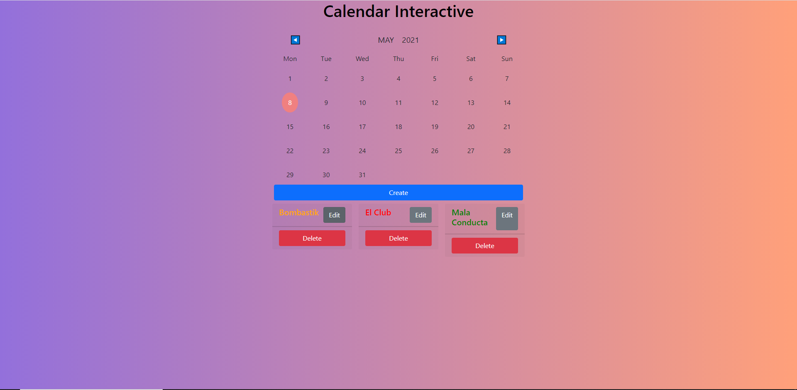

# SlabCode Technical Test


## Calendar Interactive is a Web Application Create, Edit, Delete and Display events of a calendar



## Create Event


Route where we can create our event, with the fields next:

- Name Event
- Locate of the Event
- Color of Name Event
- Date Event
- Start Time
- End Time
- Description of Event

## Edit Event


Route where we can edit our event

## Delete Event

Click the Delete button, the event will automatically be deleted

## Display Event

Click on the day where you save your event in the event that on that day there event will be shown, otherwise it will say that there are no events on that day!

# Backend

This Project is made with the MERN Stack (Mongo, Express, React, NodeJS), the Backend is 100% separate from the Frontend.

## Installation

```
git clone https://github.com/AraqueGD/SlabCode_TechnicalTest.git
cd backend
npm install
npm run dev
```

# Frontend

Frontend is made with REACT

## Installation

```
cd frontend
npm install
npm run start
```

# Improvements for the Future

- Bugs Fixeds

# Author

- Camilo Araque <https://github.com/AraqueGD>
